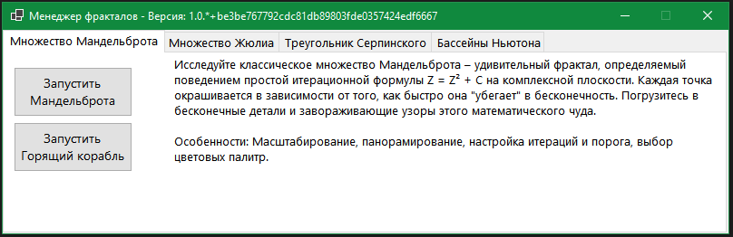
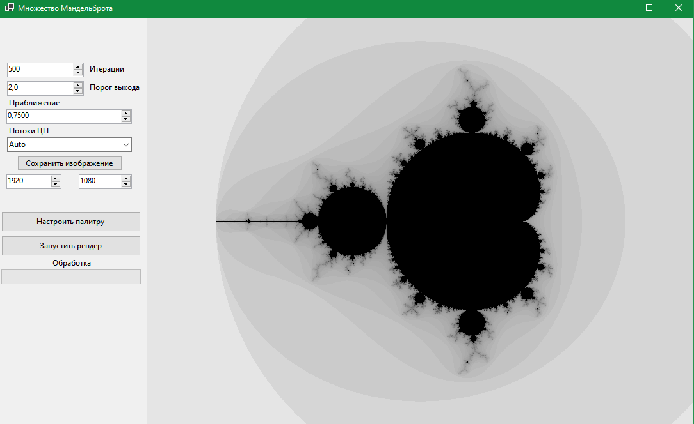
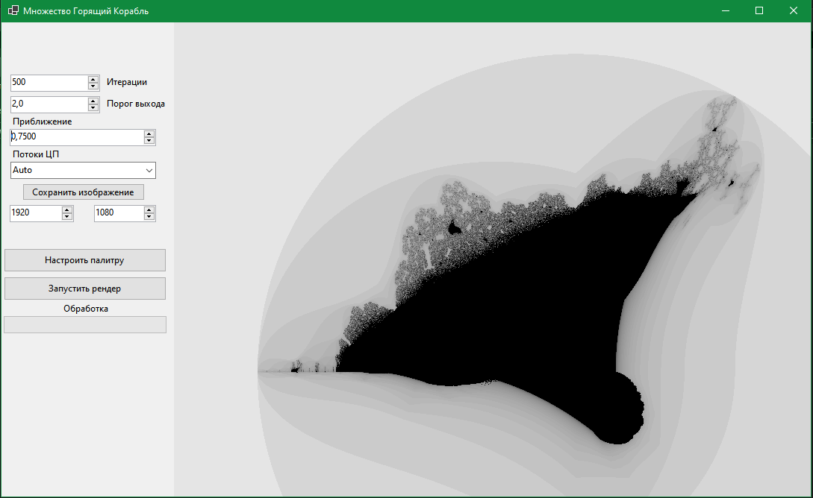
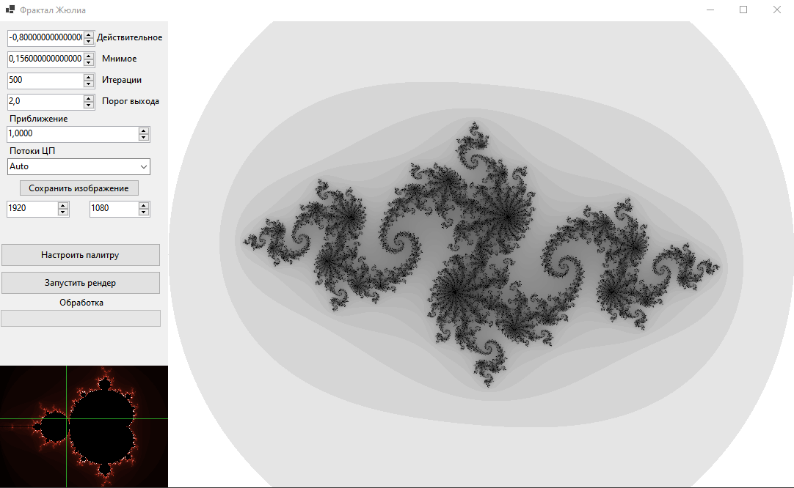
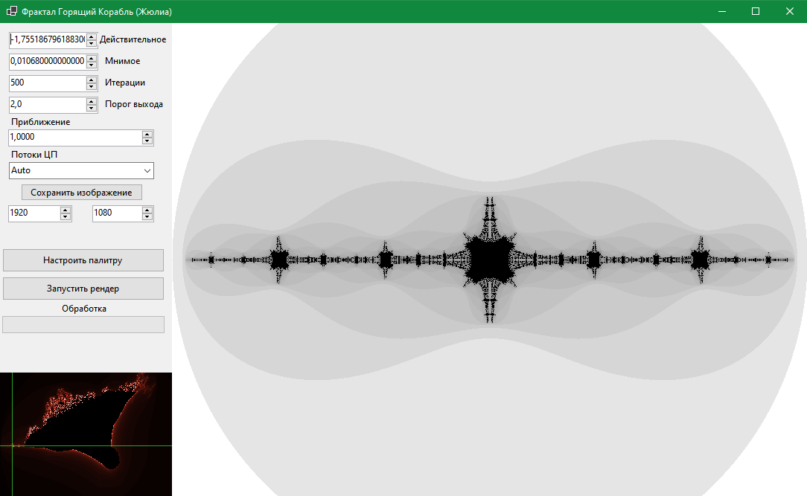
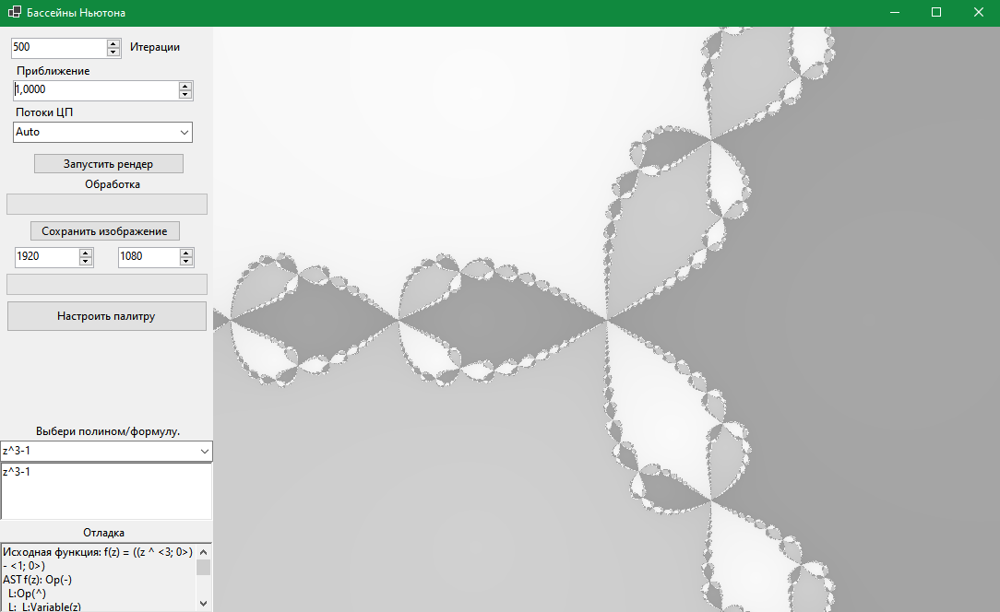

# Fractal Explorer

Welcome to Fractal Explorer! This is a Windows Forms application written in C# that allows you to generate, explore, and customize various types of beautiful fractal images.

## 🌟 Key Features

*   **Variety of Fractals:** Explore classic and lesser-known fractals:
    *   Mandelbrot Set
    *   Julia Set (with interactive 'C' constant selection)
    *   Burning Ship (Mandelbrot and Julia versions)
    *   Serpinski Triangle (Geometric method and Chaos Game)
    *   Newton Pools (with the ability to input custom formulas)
*   **Interactive Navigation:**
    *   Smooth zooming using the mouse wheel.
    *   Panning the image by dragging with the mouse.
*   **Deep Parameter Customization:**
    *   Control the number of iterations and escape threshold.
    *   Adjust the 'C' constant for Julia sets using a visual selector on a preview of the Mandelbrot or Burning Ship set.
    *   Select the number of CPU threads to speed up rendering.
*   **Advanced Color Management:**
    *   **For Mandelbrot/Julia Family:**
        *   Powerful palette editor: create, edit, and save custom palettes.
        *   Support for gradient and discrete (cyclic) palettes.
        *   A set of built-in palettes for a quick start.
        *   Saving custom palettes in JSON format.
    *   **For Newton Pools:**
        *   Specialized color settings for each root of the equation.
        *   Background color selection.
        *   Toggle between gradient and discrete coloring for basins.
        *   Save and load custom palettes for Newton fractals.
    *   **For Serpinski Triangle:**
        *   Choice of rendering mode: black & white, grayscale, custom colors for fractal and background.
*   **Rendering and Saving:**
    *   Tile-based rendering for previews with process visualization.
    *   Multi-threaded rendering for efficient use of CPU resources.
    *   Save fractals in high resolution (PNG) with customizable dimensions.
    *   Progress bars for rendering and saving operations.
*   **Custom Input for Newton Pools:**
    *   Built-in parser for mathematical expressions (complex functions `f(z)`).
    *   Ability to choose from preset formulas or input your own.
    *   Display of parser debug information and found roots.
*   **High-Precision Math:**
    *   Use of a custom `ComplexDecimal` type for high-precision complex number operations (based on `decimal`).

## 🚀 Implemented Fractals

*   **Mandelbrot Set:** `z = z² + c`
*   **Julia Set:** `z = z² + c` (with a selectable constant `c`)
*   **Burning Ship (Mandelbrot):** `z = (|Re(z)| + i * |-Im(z)|)² + c`
*   **Burning Ship (Julia):** `z = (|Re(z)| + i * |-Im(z)|)² + c` (with a selectable constant `c`)
*   **Serpinski Triangle:**
    *   Geometric method (recursive construction)
    *   "Chaos Game" (stochastic method)
*   **Newton Pools:** Iterative Newton's method for finding roots of complex functions `f(z)`. Regions are colored based on which root the point converges to.

## 🛠️ Technical Details

*   **Language:** C#
*   **Platform:** .NET Windows Forms
*   **Rendering:**
    *   Tile-based system for incremental display.
    *   Multithreading to accelerate calculations.
    *   Visualizer for the tile rendering process.
*   **Mathematics:**
    *   Custom `ComplexDecimal` structure for high-precision complex numbers.
    *   Mathematical expression parser for the Newton fractal (supports numbers, variable 'z', 'i', and operators `+`, `-`, `*`, `/`, `^`).
*   **Palettes:**
    *   Serialization of custom palettes to JSON using a custom `JsonColorConverter`.

## 🖥️ How to Use

1.  Launch the application `FractalExplorer.exe`.
2.  In the main window ("Fractal Manager" / "Менеджер фракталов"), select the fractal type you are interested in from the tabs.
3.  Click the "Launch" button for the respective fractal.
4.  In the opened fractal window:
    *   Adjust parameters (iterations, zoom, 'C' constant for Julia, etc.) on the left panel.
    *   Configure the color palette (if available for the given fractal type).
    *   Use the mouse wheel to zoom and the left mouse button to pan the view.
    *   Click "Render" to update the image with new parameters.
    *   Save your favorite images in high resolution.

## 🖼️ Screenshots

  
  
  
  
  
  
  

## 📜 License

# Исследователь Фракталов (Fractal Explorer)

Добро пожаловать в "Исследователь Фракталов"! Это приложение для Windows Forms, написанное на C#, позволяет генерировать, исследовать и настраивать различные типы красивых фрактальных изображений.

## 🌟 Ключевые Возможности

*   **Разнообразие Фракталов:** Исследуйте классические и менее известные фракталы:
    *   Множество Мандельброта
    *   Множество Жюлиа (с интерактивным выбором константы 'C')
    *   Горящий Корабль (версии Мандельброта и Жюлиа)
    *   Треугольник Серпинского (геометрический метод и "Игра Хаоса")
    *   Бассейны Ньютона (с возможностью ввода собственных формул)
*   **Интерактивная Навигация:**
    *   Плавное масштабирование с помощью колеса мыши.
    *   Панорамирование изображения перетаскиванием мыши.
*   **Глубокая Настройка Параметров:**
    *   Управление количеством итераций и порогом выхода.
    *   Настройка константы 'C' для множеств Жюлиа с помощью визуального селектора на превью множества Мандельброта или Горящего Корабля.
    *   Выбор количества потоков ЦП для ускорения рендеринга.
*   **Продвинутая Работа с Цветом:**
    *   **Для семейства Мандельброта/Жюлиа:**
        *   Мощный редактор палитр: создавайте, редактируйте и сохраняйте пользовательские палитры.
        *   Поддержка градиентных и дискретных (циклических) палитр.
        *   Набор встроенных палитр для быстрого старта.
        *   Сохранение пользовательских палитр в формате JSON.
    *   **Для Бассейнов Ньютона:**
        *   Специализированная настройка цветов для каждого корня уравнения.
        *   Выбор цвета фона.
        *   Переключение между градиентной и дискретной окраской бассейнов.
        *   Сохранение и загрузка пользовательских палитр для Ньютона.
    *   **Для Треугольника Серпинского:**
        *   Выбор режима отрисовки: черно-белый, оттенки серого, пользовательские цвета для фрактала и фона.
*   **Рендеринг и Сохранение:**
    *   Плиточный (тайловый) рендеринг для предпросмотра с визуализацией процесса.
    *   Многопоточный рендеринг для эффективного использования ресурсов ЦП.
    *   Сохранение фракталов в высоком разрешении (PNG) с настраиваемыми размерами.
    *   Прогресс-бары для операций рендеринга и сохранения.
*   **Пользовательский Ввод для Бассейнов Ньютона:**
    *   Встроенный парсер для математических выражений (комплексные функции `f(z)`).
    *   Возможность выбора из предустановленных формул или ввода своей собственной.
    *   Отображение отладочной информации парсера и найденных корней.
*   **Высокоточная Математика:**
    *   Использование пользовательского типа `ComplexDecimal` для операций с комплексными числами повышенной точности (на основе `decimal`).

## 🚀 Реализованные Фракталы

*   **Множество Мандельброта:** `z = z² + c`
*   **Множество Жюлиа:** `z = z² + c` (с выбираемой константой `c`)
*   **Горящий Корабль (Мандельброт):** `z = (|Re(z)| + i * |-Im(z)|)² + c`
*   **Горящий Корабль (Жюлиа):** `z = (|Re(z)| + i * |-Im(z)|)² + c` (с выбираемой константой `c`)
*   **Треугольник Серпинского:**
    *   Геометрический метод (рекурсивное построение)
    *   "Игра Хаоса" (стохастический метод)
*   **Бассейны Ньютона:** Итерационный метод Ньютона для поиска корней комплексных функций `f(z)`. Области окрашиваются в зависимости от того, к какому корню сходится точка.

## 🛠️ Технические Детали

*   **Язык:** C#
*   **Платформа:** .NET Windows Forms
*   **Рендеринг:**
    *   Плиточная (тайловая) система для инкрементального отображения.
    *   Многопоточность для ускорения вычислений.
    *   Визуализатор процесса рендеринга плиток.
*   **Математика:**
    *   Пользовательская структура `ComplexDecimal` для высокоточных комплексных чисел.
    *   Парсер математических выражений для фрактала Ньютона (поддерживает числа, переменную 'z', 'i' и операторы `+`, `-`, `*`, `/`, `^`).
*   **Палитры:**
    *   Сериализация пользовательских палитр в JSON с использованием кастомного `JsonColorConverter`.

## 🖥️ Как Использовать

1.  Запустите приложение `FractalExplorer.exe`.
2.  В главном окне ("Менеджер фракталов") выберите интересующий вас тип фрактала из вкладок.
3.  Нажмите кнопку "Запустить" для соответствующего фрактала.
4.  В открывшемся окне фрактала:
    *   Настройте параметры (итерации, масштаб, константу 'C' для Жюлиа и т.д.) на панели слева.
    *   Настройте цветовую палитру (если доступно для данного типа фрактала).
    *   Используйте колесо мыши для масштабирования и левую кнопку мыши для панорамирования области просмотра.
    *   Нажмите "Запустить рендер" для обновления изображения с новыми параметрами.
    *   Сохраняйте понравившиеся изображения в высоком разрешении.

## 🖼️ Скриншоты

  
  
  
  
  
  
  

## 📜 Лицензия

---

All project AI generated
Весь проект создан при помощи ИИ
