Fractal Explorer

Welcome to Fractal Explorer! This is a comprehensive Windows Forms application written in C# that allows you to generate, explore, customize, and save a wide variety of beautiful fractal images. Dive into the infinite complexity of mathematical art with a powerful and user-friendly toolset.
🌟 Key Features

    Central Hub: A convenient launcher to access all available fractal types from a single, organized interface.

    Diverse Fractal Library: Explore classic and exotic fractals, including:

        Mandelbrot Set & Julia Set

        Burning Ship (Mandelbrot & Julia variations)

        Sierpiński Triangle (via Chaos Game)

        Newton's Pools

        Phoenix Fractal

    Interactive Exploration:

        Smooth, high-precision zooming and panning with the mouse.

        Multi-threaded rendering for responsive navigation and fast calculations.

    Deep Parameter Control:

        Adjust iteration counts, escape thresholds, and other core fractal parameters.

        Interactive C-Value Selectors:

            For Julia sets, visually pick the complex constant c by clicking on a preview of the corresponding Mandelbrot or Burning Ship set.

            For the Phoenix fractal, use a unique dual-slice selector to define the C1 (P and Q) parameters in a 4D parameter space.

Advanced Color Management

The application features three distinct, specialized palette managers, tailored to the unique needs of different fractal families.

    🎨 For Mandelbrot, Julia & Phoenix:

        A powerful editor to create, edit, copy, and save custom multi-color palettes.

        Toggle between smooth gradient and discrete cyclic coloring.

        Fine-tune the look with gamma correction and color cycle length.

        Comes with a rich set of built-in palettes to get you started.

    🔬 For Newton's Pools:

        A dynamic palette system where the number of color pickers automatically adjusts to the number of roots found for the current polynomial.

        Individually assign colors for each root's basin of attraction.

        Switch between sharp, discrete coloring and a smooth gradient based on iteration count.

    🔺 For Sierpiński Triangle:

        A straightforward yet effective manager to select custom colors for the fractal and the background, allowing for high-contrast, artistic renderings.

State & Preset Management

    Save & Load States: Save your entire fractal configuration—including position, zoom, iterations, and parameters—to a JSON file. Never lose a great discovery.

    Points of Interest: Load from a curated list of built-in presets that showcase stunning or mathematically significant locations for each fractal.

    Live Preview Generation: The save/load dialog features a high-quality, interactive preview of each saved state.

        Live Render Visualization: Watch as the preview is rendered in real-time with a tile-based visualizer.

        Progressive Caching: Previews are intelligently cached, so tiles are only rendered once per session, making subsequent views of the same state instantaneous.

High-Resolution Export

    Save Manager: A dedicated form to export your creations as high-resolution images.

    Formats: Save in PNG, JPG (with adjustable quality), or BMP formats.

    Custom Resolution: Define any output resolution, from FullHD to 4K and beyond.

    SSAA (Anti-Aliasing): Render images with Super-Sample Anti-Aliasing (from 2x to 8x) for incredibly crisp and smooth results, perfect for printing or display.

    Future-Proof: The architecture is designed to easily accommodate more post-processing filters in future updates.

🚀 Implemented Fractals

    Mandelbrot Set: z = z² + c

    Julia Set: z = z² + c (with a selectable constant c)

    Burning Ship (Mandelbrot): z = (|Re(z)| + i * |-Im(z)|)² + c

    Burning Ship (Julia): z = (|Re(z)| + i * |-Im(z)|)² + c (with a selectable constant c)

    Phoenix Fractal: z_n+1 = z_n² + c1 + c2*z_{n-1}

    Sierpiński Triangle: Generated using the "Chaos Game" stochastic method.

    Newton's Pools: Iterative Newton's method for finding roots of complex functions f(z).

        Features a built-in mathematical expression parser allowing you to input your own custom formulas like z^3 - 1 or sin(z).

🛠️ Technical Details

    Language: C#

    Platform: .NET Windows Forms

    Rendering:

        Asynchronous, multi-threaded rendering engine for both on-screen display and high-resolution export.

        Tile-based system with live visualization for previews.

    Mathematics:

        Custom ComplexDecimal structure for high-precision complex number operations, crucial for deep zooms.

        Robust mathematical expression parser for the Newton fractal (supports numbers, variable 'z', 'i', and operators +, -, *, /, ^).

    Data Persistence:

        Custom fractal states and color palettes are serialized to human-readable JSON files, saved locally in a Saves directory.

🖥️ How to Use

    Launch the application FractalExplorer.exe.

    In the main hub ("Менеджер фракталов"), select the fractal you want to explore from the tabs.

    Click the "Запустить" (Launch) button.

    In the fractal window:

        Use the left panel to adjust parameters like iterations, color palettes, and fractal-specific constants.

        Use the mouse wheel to zoom and the left mouse button to pan the view.

        Click "Запустить рендер" (Render) to update the image.

        Use the "Сохранить/Загрузить состояние" (Save/Load State) button to manage your fractal configurations.

        Use the "Сохранить изображение" (Save Image) button to export your final artwork in high resolution.

🖼️ Gallery
<table>
<tr>
<td align="center"><b>Launcher Hub</b> 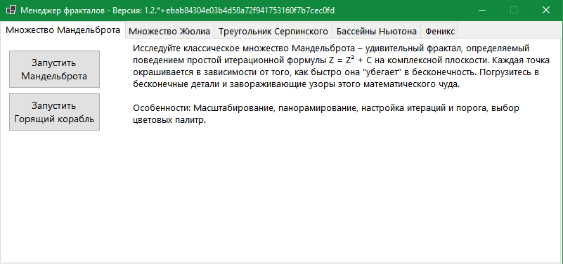</td>
<td align="center"><b>Mandelbrot Set</b> 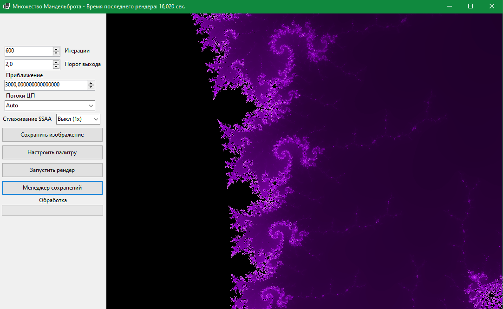</td>
<td align="center"><b>Burning Ship (Mandelbrot)</b> 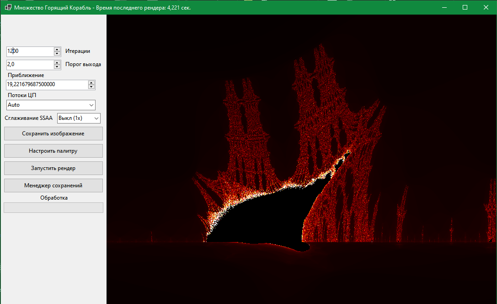</td>
</tr>
<tr>
<td align="center"><b>Julia Set</b> 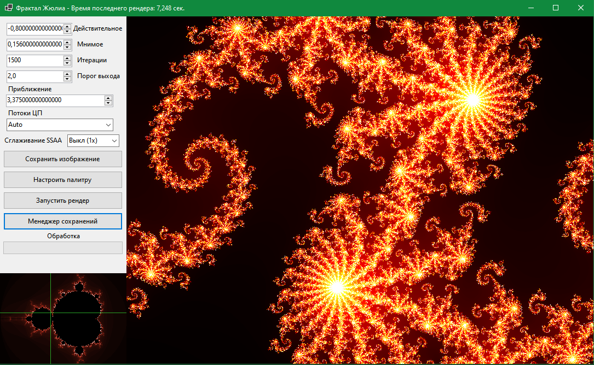</td>
<td align="center"><b>Burning Ship (Julia)</b> 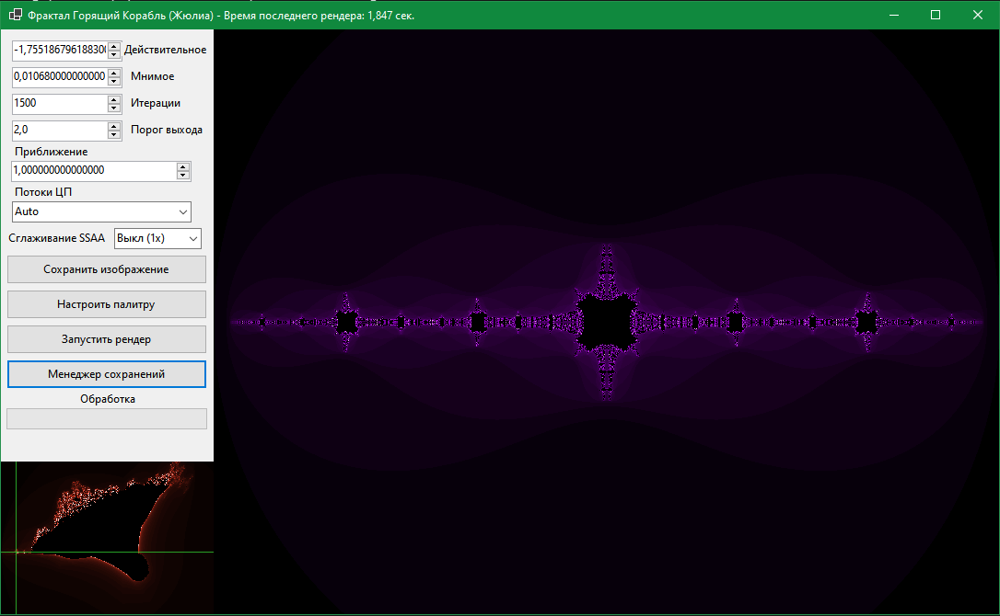</td>
<td align="center"><b>Julia 'C' Point Selector</b> 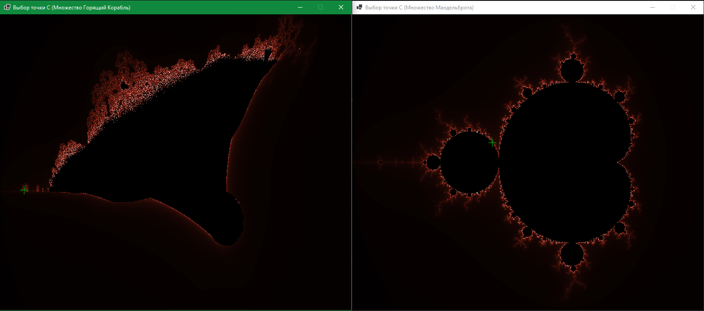</td>
</tr>
<tr>
<td align="center"><b>Sierpiński Triangle</b> </td>
<td align="center"><b>Newton's Pools</b> 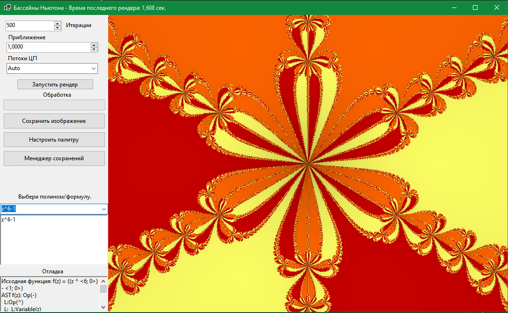</td>
<td align="center"><b>Phoenix Fractal</b> 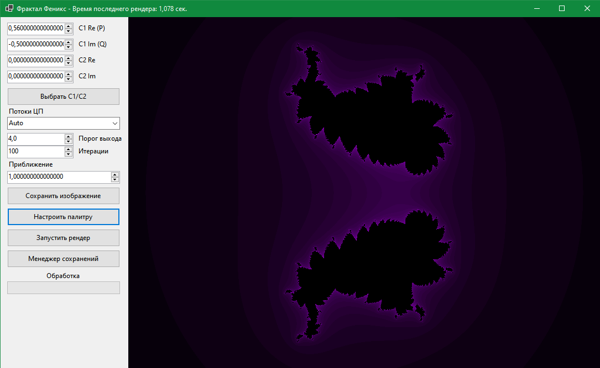</td>
</tr>
<tr>
<td align="center"><b>Phoenix 'C1' Parameter Selector</b> 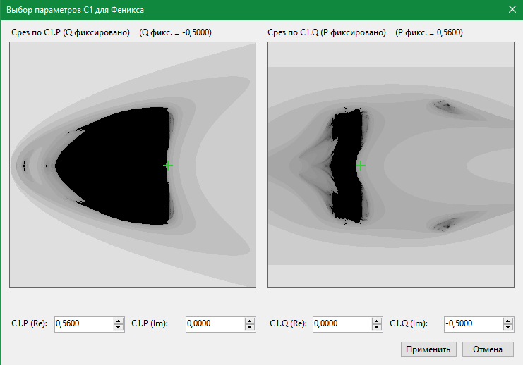</td>
<td align="center"><b>Palette Manager (Mandelbrot)</b> 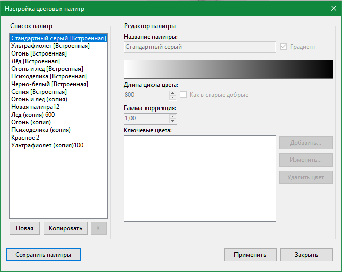</td>
<td align="center"><b>Palette Manager (Newton)</b> 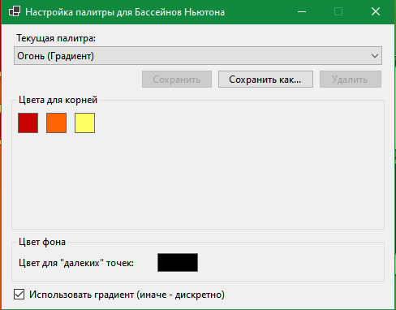</td>
</tr>
<tr>
<td align="center"><b>Palette Manager (Sierpiński)</b> </td>
<td align="center"><b>Save/Load State Manager</b> 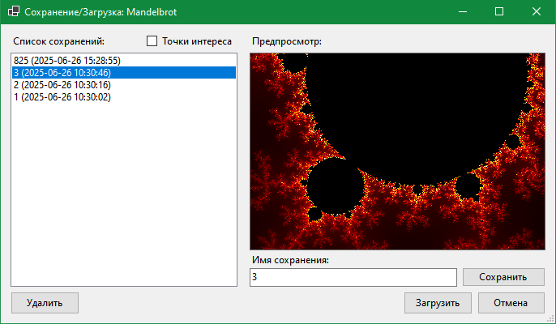</td>
<td align="center"><b>Live Preview Rendering</b> </td>
</tr>
</table>
📜 License

This project is distributed under the Apache 2.0 license. The full text of the license is available in LICENSE.md.
Исследователь Фракталов (Fractal Explorer)

Добро пожаловать в "Исследователь Фракталов"! Это комплексное приложение для Windows Forms, написанное на C#, которое позволяет генерировать, исследовать, настраивать и сохранять разнообразные и красивые фрактальные изображения. Погрузитесь в бесконечную сложность математического искусства с помощью мощного и удобного инструментария.
🌟 Ключевые Возможности

    Центральный Хаб: Удобный лаунчер для доступа ко всем доступным типам фракталов из единого, организованного интерфейса.

    Разнообразная Библиотека Фракталов: Исследуйте классические и экзотические фракталы, включая:

        Множество Мандельброта и Множество Жюлиа

        Горящий Корабль (в вариациях Мандельброта и Жюлиа)

        Треугольник Серпинского (метод "Игры Хаоса")

        Бассейны Ньютона

        Фрактал Феникс

    Интерактивное Исследование:

        Плавное, высокоточное масштабирование и панорамирование с помощью мыши.

        Многопоточный рендеринг для отзывчивой навигации и быстрых вычислений.

    Глубокая Настройка Параметров:

        Управление количеством итераций, порогом выхода и другими ключевыми параметрами фракталов.

        Интерактивные Селекторы Константы 'C':

            Для множеств Жюлиа — визуальный выбор комплексной константы c кликом по превью соответствующего множества Мандельброта или Горящего Корабля.

            Для фрактала Феникс — уникальный селектор с двумя срезами для определения параметров C1 (P и Q) в 4D-пространстве.

Продвинутая Работа с Цветом

Приложение включает три различных, специализированных менеджера палитр, созданных для уникальных потребностей разных семейств фракталов.

    🎨 Для Мандельброта, Жюлиа и Феникса:

        Мощный редактор для создания, редактирования, копирования и сохранения пользовательских многоцветных палитр.

        Переключение между плавной градиентной и дискретной циклической окраской.

        Тонкая настройка вида с помощью гамма-коррекции и длины цветового цикла.

        Поставляется с богатым набором встроенных палитр для быстрого старта.

    🔬 Для Бассейнов Ньютона:

        Динамическая система палитр, где количество палитр с цветами автоматически подстраивается под число корней, найденных для текущего полинома.

        Индивидуальное назначение цветов для каждого бассейна притяжения корня.

        Переключение между четкой, дискретной окраской и плавным градиентом на основе числа итераций.

    🔺 Для Треугольника Серпинского:

        Простой, но эффективный менеджер для выбора пользовательских цветов для самого фрактала и фона, что позволяет создавать высококонтрастные, художественные изображения.

Управление Состояниями и Пресетами

    Сохранение и Загрузка Состояний: Сохраняйте всю конфигурацию фрактала — включая позицию, масштаб, итерации и параметры — в файл JSON. Никогда не теряйте свои лучшие находки.

    Точки Интереса: Загружайте состояния из встроенного списка пресетов, которые демонстрируют потрясающие или математически значимые места для каждого фрактала.

    Генерация Превью в Реальном Времени: Диалог сохранения/загрузки отображает высококачественное, интерактивное превью каждого сохраненного состояния.

        Визуализация Рендеринга: Наблюдайте, как превью отрисовывается в реальном времени с помощью плиточного (тайлового) визуализатора.

        Прогрессивное Кэширование: Превью интеллектуально кэшируются, поэтому плитки отрисовываются только один раз за сессию, делая последующие просмотры того же состояния мгновенными.

Экспорт в Высоком Разрешении

    Менеджер Сохранения: Специальная форма для экспорта ваших творений в виде изображений высокого разрешения.

    Форматы: Сохранение в PNG, JPG (с настраиваемым качеством) или BMP.

    Пользовательское Разрешение: Задавайте любое разрешение на выходе, от FullHD до 4K и выше.

    SSAA (Сглаживание): Рендеринг изображений с суперсэмплингом (от 2x до 8x) для невероятно четких и плавных результатов, идеальных для печати или демонстрации.

    Задел на Будущее: Архитектура спроектирована так, чтобы легко добавлять новые фильтры постобработки в будущих обновлениях.

🚀 Реализованные Фракталы

    Множество Мандельброта: z = z² + c

    Множество Жюлиа: z = z² + c (с выбираемой константой c)

    Горящий Корабль (Мандельброт): z = (|Re(z)| + i * |-Im(z)|)² + c

    Горящий Корабль (Жюлиа): z = (|Re(z)| + i * |-Im(z)|)² + c (с выбираемой константой c)

    Фрактал Феникс: z_n+1 = z_n² + c1 + c2*z_{n-1}

    Треугольник Серпинского: Генерируется с помощью стохастического метода "Игра Хаоса".

    Бассейны Ньютона: Итерационный метод Ньютона для поиска корней комплексных функций f(z).

        Включает встроенный парсер математических выражений, позволяющий вводить собственные формулы, такие как z^3 - 1 или sin(z).

🛠️ Технические Детали

    Язык: C#

    Платформа: .NET Windows Forms

    Рендеринг:

        Асинхронный, многопоточный движок рендеринга для отображения на экране и экспорта в высоком разрешении.

        Плиточная система с живой визуализацией для превью.

    Математика:

        Пользовательская структура ComplexDecimal для высокоточных операций с комплексными числами, что критически важно для глубоких увеличений.

        Надежный парсер математических выражений для фрактала Ньютона (поддерживает числа, переменную 'z', 'i' и операторы +, -, *, /, ^).

    Сохранение Данных:

        Пользовательские состояния фракталов и цветовые палитры сериализуются в читаемые JSON файлы и сохраняются локально в директорию Saves.

🖥️ Как Использовать

    Запустите приложение FractalExplorer.exe.

    В главном хабе ("Менеджер фракталов") выберите интересующий вас фрактал из вкладок.

    Нажмите кнопку "Запустить".

    В окне фрактала:

        Используйте левую панель для настройки параметров: итераций, цветовых палитр и специфичных для фрактала констант.

        Используйте колесо мыши для масштабирования и левую кнопку мыши для панорамирования.

        Нажмите "Запустить рендер" для обновления изображения.

        Используйте кнопку "Сохранить/Загрузить состояние" для управления конфигурациями фракталов.

        Используйте кнопку "Сохранить изображение" для экспорта вашего финального произведения в высоком разрешении.

🖼️ Галерея
<table>
<tr>
<td align="center"><b>Лаунчер-Хаб</b> </td>
<td align="center"><b>Множество Мандельброта</b> </td>
<td align="center"><b>Горящий Корабль (Мандельброт)</b> </td>
</tr>
<tr>
<td align="center"><b>Множество Жюлиа</b> </td>
<td align="center"><b>Горящий Корабль (Жюлиа)</b> </td>
<td align="center"><b>Селектор точки 'C' для Жюлиа</b> </td>
</tr>
<tr>
<td align="center"><b>Треугольник Серпинского</b> </td>
<td align="center"><b>Бассейны Ньютона</b> </td>
<td align="center"><b>Фрактал Феникс</b> </td>
</tr>
<tr>
<td align="center"><b>Селектор параметра 'C1' для Феникса</b> </td>
<td align="center"><b>Менеджер палитр (Мандельброт)</b> </td>
<td align="center"><b>Менеджер палитр (Ньютон)</b> </td>
</tr>
<tr>
<td align="center"><b>Менеджер палитр (Серпинский)</b> </td>
<td align="center"><b>Менеджер состояний</b> </td>
<td align="center"><b>Рендеринг превью в реальном времени</b> </td>
</tr>
</table>
📜 Лицензия

Этот проект распространяется под лицензией Apache 2.0. Полный текст лицензии доступен в LICENSE.md.

Project AI generated. Проект создан при помощи ИИ.
