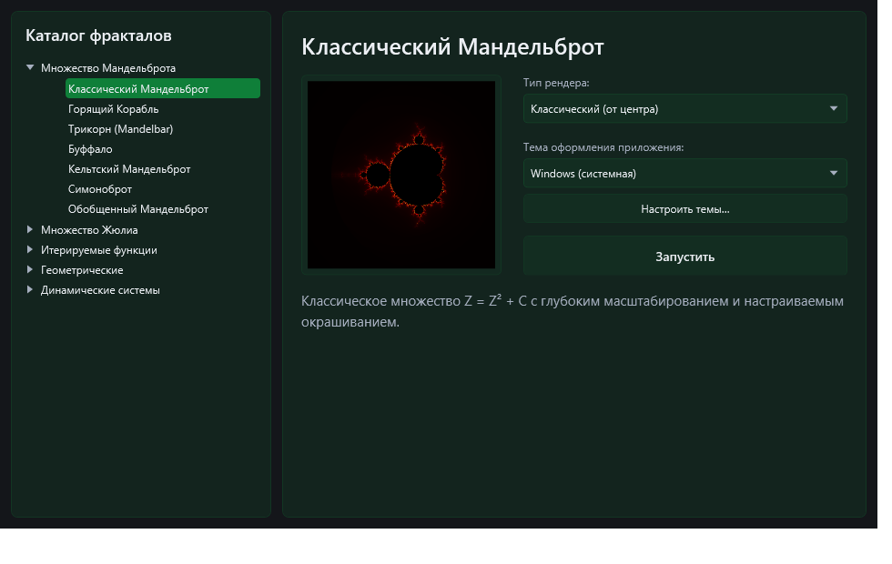
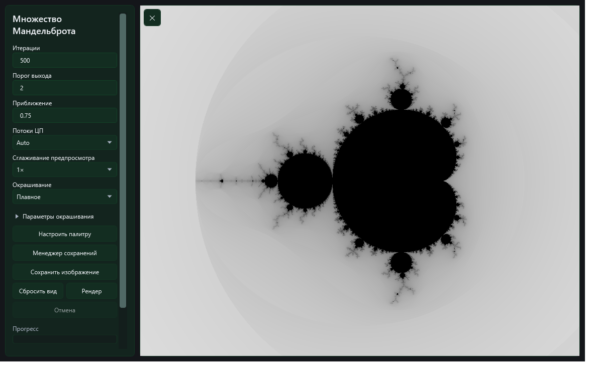
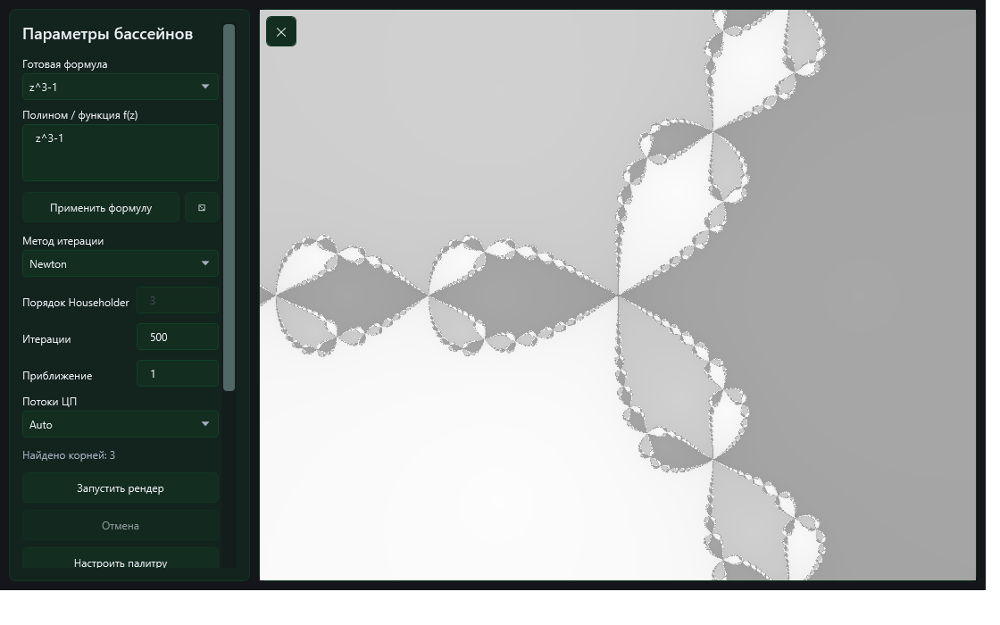
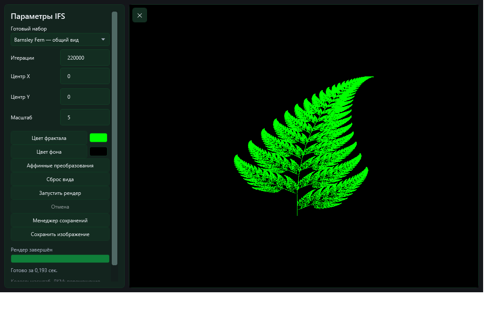
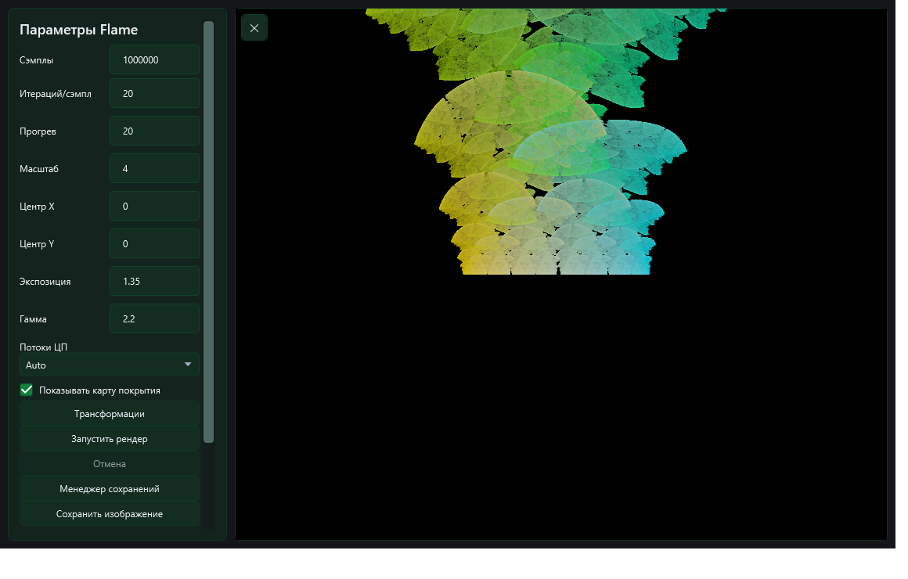
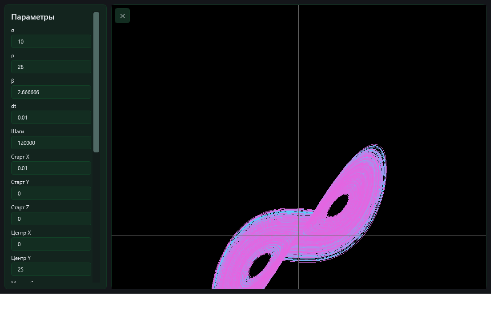
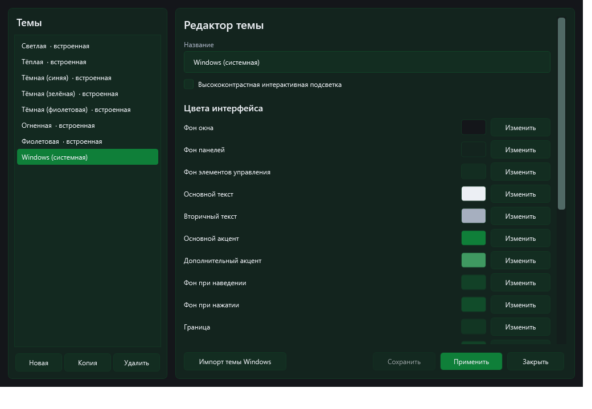

# Fractal Explorer WPF

[Русский](#русский) · [English](#english)

<a id="русский"></a>

## Русский

Интерактивная лаборатория фракталов и динамических систем для Windows. Актуальная версия проекта построена на WPF и объединяет исследование комплексных множеств, стохастические визуализации, редакторы параметров, палитры, сохранения и экспорт изображений в одном приложении.

<p align="center">
  
</p>

> WPF — основное направление разработки. Предыдущая реализация на Windows Forms сохранена в каталоге `FractalExplorer` как legacy-версия.

### Возможности

- **28 пунктов каталога:** 26 визуализаций и 2 галереи констант Julia.
- **Интерактивное исследование:** масштабирование колесом мыши, перемещение холста, сброс вида и полноэкранный режим.
- **Асинхронный рендеринг на CPU:** настройка числа потоков, отмена вычисления, индикаторы прогресса и восемь схем появления плиток.
- **Гибкое окрашивание:** встроенные и пользовательские палитры, плавные и дискретные режимы, Histogram, Orbit Trap и Stripe Average для семейства Mandelbrot.
- **Сохранение исследований:** параметры фрактала, превью и точки интереса хранятся в JSON и восстанавливаются через менеджер сохранений.
- **Экспорт изображений:** произвольное разрешение, пресеты вплоть до 8K, PNG/JPG/BMP, SSAA, Bicubic и Lanczos 3.
- **Настраиваемый WPF-интерфейс:** встроенные темы, системная тема Windows, редактор цветов и экранная пипетка.

### Каталог визуализаций

| Семейство | Доступные модули |
| --- | --- |
| Множество Мандельброта | Mandelbrot, Burning Ship, Tricorn (Mandelbar), Buffalo, Celtic Mandelbrot, Simonobrot, Generalized Mandelbrot |
| Множество Жюлиа | Julia, Julia Burning Ship и две галереи констант `C` |
| Итерируемые функции | Newton Pools+, Phoenix, Collatz, Nova Mandelbrot, Nova Julia, Buddhabrot / Anti-Buddhabrot, Fractal Flame |
| Геометрические фракталы | L‑системы (Кох, Гильберт, Леви, Dragon Curve, деревья, растения, Серпинский), Серпинский — игра хаоса, IFS Барнсли / Хейуэя |
| Динамические системы | Lyapunov, Lorenz, Rössler, Logistic Map, Bifurcation, Hénon, Ikeda |

### Интерфейс

#### Комплексные множества

Рабочие окна объединяют параметры формулы, управление качеством и потоками, палитры, сохранения и экспорт. Семейство Mandelbrot использует общий движок и единый интерфейс для классического множества и его вариантов.

<p align="center">
  
</p>

#### Итерируемые функции и IFS

Newton Pools+ поддерживает готовые и пользовательские формулы, методы Newton, Halley и Householder. IFS включает готовые наборы и редактор аффинных преобразований.

<table>
  <tr>
    <td width="50%"></td>
    <td width="50%"></td>
  </tr>
  <tr>
    <td align="center"><sub>Newton Pools+</sub></td>
    <td align="center"><sub>IFS — папоротник Барнсли</sub></td>
  </tr>
</table>

#### L‑системы

Модуль L‑систем объединяет готовые геометрические фракталы и редактор аксиомы, правил, угла, глубины и рисующих символов. Цвет и толщину можно распределять по поколению, глубине ветвления или ходу построения; построение анимируется и экспортируется в высоком разрешении. Геометрический треугольник Серпинского входит в этот общий режим, а стохастическая «игра хаоса» доступна отдельным пунктом каталога.

#### Стохастические фракталы и динамические системы

Fractal Flame использует накопление HDR-гистограммы и настраиваемые трансформации. Отдельное семейство модулей визуализирует непрерывные и дискретные динамические системы.

<table>
  <tr>
    <td width="50%"></td>
    <td width="50%"></td>
  </tr>
  <tr>
    <td align="center"><sub>Fractal Flame</sub></td>
    <td align="center"><sub>Аттрактор Лоренца</sub></td>
  </tr>
</table>

#### Темы оформления

Редактор тем позволяет создавать и копировать темы, менять цвета элементов интерфейса и применять оформление Windows.

<p align="center">
  
</p>

### Управление

| Действие | Управление |
| --- | --- |
| Масштабирование относительно курсора | Колесо мыши над холстом |
| Перемещение области просмотра | Перетаскивание левой кнопкой мыши |
| Полноэкранный режим | `F11` |
| Выход из полноэкранного режима | `Esc` |
| Скрытие панели параметров | Кнопка в левом верхнем углу холста |

Конкретные параметры, доступные режимы окрашивания и дополнительные интерактивные карты зависят от выбранного фрактала.

### Сохранения и экспорт

Менеджеры сохранений запоминают формулу, координаты, масштаб, качество рендера, палитру и точки интереса. Для записей создаются превью, а данные хранятся локально в JSON.

Менеджер экспорта позволяет задавать размер изображения вручную или выбрать готовый пресет, формат файла и способ финальной обработки:

- нативный рендер или SSAA;
- бикубическое масштабирование;
- фильтр Lanczos 3;
- PNG, JPG с настройкой качества и BMP.

### Сборка и запуск

Требуются Windows и [.NET 10 SDK](https://dotnet.microsoft.com/download/dotnet/10.0).

```powershell
git clone <repository-url>
cd FractalExplorer
dotnet build .\FractalExplorerWPF\FractalExplorerWPF\FractalExplorerWPF.slnx
dotnet run --project .\FractalExplorerWPF\FractalExplorerWPF\FractalExplorerWPF\FractalExplorerWPF.csproj
```

Для разработки решение также можно открыть в Visual Studio с установленной рабочей нагрузкой .NET Desktop Development.

### Структура репозитория

```text
FractalExplorerWPF/   основная WPF-версия
FractalExplorer/      предыдущая WinForms-версия
Pictures/             архив изображений предыдущих версий
README.md             описание актуальной WPF-версии
```

README-скриншоты хранятся вместе с WPF-проектом в `FractalExplorerWPF/FractalExplorerWPF/FractalExplorerWPF/Assets/Screenshots/README`.

### Лицензия

Проект распространяется по лицензии [Apache License 2.0](./LICENSE).

---

<a id="english"></a>

## English

An interactive fractal and dynamical-systems laboratory for Windows. The current version is built with WPF and brings complex-set exploration, stochastic visualizations, parameter editors, palettes, saved states, and image export together in one application.

<p align="center">
  
</p>

> WPF is the primary development direction. The previous Windows Forms implementation remains available in the `FractalExplorer` directory as a legacy version.

### Features

- **28 catalog entries:** 26 visualizations and 2 Julia constant galleries.
- **Interactive exploration:** cursor-centered mouse-wheel zoom, canvas panning, view reset, and full-screen mode.
- **Asynchronous CPU rendering:** configurable thread count, cancellation, progress indicators, and eight tile scheduling patterns.
- **Flexible coloring:** built-in and custom palettes, smooth and discrete modes, plus Histogram, Orbit Trap, and Stripe Average for the Mandelbrot family.
- **Saved explorations:** fractal parameters, previews, and points of interest are stored as JSON and restored through dedicated save managers.
- **Image export:** custom resolutions, presets up to 8K, PNG/JPG/BMP, SSAA, Bicubic, and Lanczos 3.
- **Customizable WPF interface:** built-in themes, the Windows system theme, a color editor, and an on-screen eyedropper.

### Visualization catalog

| Family | Available modules |
| --- | --- |
| Mandelbrot set | Mandelbrot, Burning Ship, Tricorn (Mandelbar), Buffalo, Celtic Mandelbrot, Simonobrot, Generalized Mandelbrot |
| Julia set | Julia, Julia Burning Ship, and two constant-`C` galleries |
| Iterated functions | Newton Pools+, Phoenix, Collatz, Nova Mandelbrot, Nova Julia, Buddhabrot / Anti-Buddhabrot, Fractal Flame |
| Geometric fractals | L‑systems (Koch, Hilbert, Lévy C, Dragon Curve, trees, plants, Sierpiński), Sierpiński chaos game, Barnsley / Heighway IFS |
| Dynamical systems | Lyapunov, Lorenz, Rössler, Logistic Map, Bifurcation, Hénon, Ikeda |

### Interface

#### Complex sets

The exploration windows combine formula parameters, quality and thread controls, palettes, saved states, and image export. The Mandelbrot family uses a shared engine and a consistent interface for the classic set and its variants.

<p align="center">
  
</p>

#### Iterated functions and IFS

Newton Pools+ supports presets and custom formulas together with the Newton, Halley, and Householder methods. The IFS module includes ready-made presets and an affine-transform editor.

<table>
  <tr>
    <td width="50%"></td>
    <td width="50%"></td>
  </tr>
  <tr>
    <td align="center"><sub>Newton Pools+</sub></td>
    <td align="center"><sub>Barnsley fern IFS</sub></td>
  </tr>
</table>

#### L‑systems

The L‑system module combines geometric presets with an editor for the axiom, rewriting rules, angle, depth, and drawing symbols. Color and thickness can follow symbol generation, branch depth, or drawing order; construction can be animated and exported at high resolution. Geometric Sierpiński is a preset in this shared module, while its stochastic chaos game remains a separate catalog entry.

#### Stochastic fractals and dynamical systems

Fractal Flame uses HDR histogram accumulation and configurable transforms. A separate family of modules visualizes continuous and discrete dynamical systems.

<table>
  <tr>
    <td width="50%"></td>
    <td width="50%"></td>
  </tr>
  <tr>
    <td align="center"><sub>Fractal Flame</sub></td>
    <td align="center"><sub>Lorenz attractor</sub></td>
  </tr>
</table>

#### Themes

The theme editor can create and copy themes, customize interface colors, and apply the current Windows appearance.

<p align="center">
  
</p>

### Controls

| Action | Control |
| --- | --- |
| Zoom around the cursor | Mouse wheel over the canvas |
| Pan the viewport | Drag with the left mouse button |
| Enter full-screen mode | `F11` |
| Leave full-screen mode | `Esc` |
| Hide the parameter panel | Button in the canvas's upper-left corner |

The exact parameters, coloring modes, and additional interactive maps depend on the selected fractal.

### Saved states and export

Save managers preserve the formula, coordinates, zoom level, render quality, palette, and points of interest. Each entry includes a preview, while its data is stored locally as JSON.

The export manager supports manual dimensions and ready-made presets, multiple formats, and several final-processing strategies:

- native rendering or SSAA;
- bicubic scaling;
- Lanczos 3 filtering;
- PNG, quality-configurable JPG, and BMP.

### Build and run

Windows and the [.NET 10 SDK](https://dotnet.microsoft.com/download/dotnet/10.0) are required.

```powershell
git clone <repository-url>
cd FractalExplorer
dotnet build .\FractalExplorerWPF\FractalExplorerWPF\FractalExplorerWPF.slnx
dotnet run --project .\FractalExplorerWPF\FractalExplorerWPF\FractalExplorerWPF\FractalExplorerWPF.csproj
```

For development, the solution can also be opened in Visual Studio with the .NET Desktop Development workload installed.

### Repository structure

```text
FractalExplorerWPF/   primary WPF version
FractalExplorer/      previous WinForms version
Pictures/             archive of images from previous versions
README.md             documentation for the current WPF version
```

README screenshots are stored with the WPF project under `FractalExplorerWPF/FractalExplorerWPF/FractalExplorerWPF/Assets/Screenshots/README`.

### License

This project is distributed under the [Apache License 2.0](./LICENSE).
